# Voicemask Arduino
Este proyecto es un prototipo de mascarilla con arduino programado, que imprime en una matriz de leds una representacion de la boca segun la intensidad de un sonido. Codigo basado y modificado de TylerGlaiel.

# Electrónica
|   |   |   |
|---|---|---|
| Arduino nano|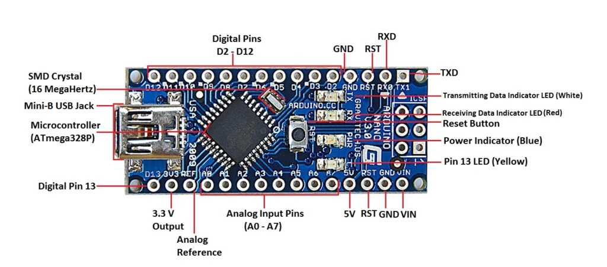||
| Matriz leds 8x8 |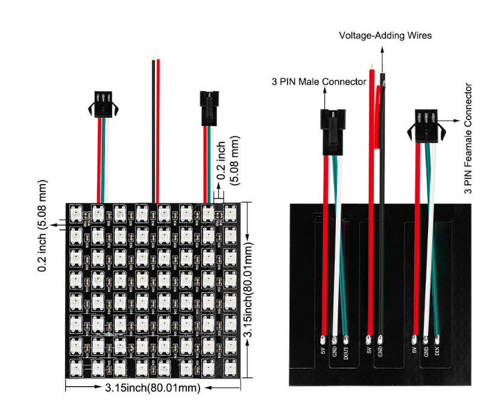  |[](https://www.ebay.es/itm/Arduino-8x8-RGB-LED-Flexible-Matrix-Dream-Color-Individually-Addressable-LED/392684589504?_trkparms=aid%3D111001%26algo%3DREC.SEED%26ao%3D1%26asc%3D20160908105057%26meid%3Df6e0241a0aa64f5dacaecf50fd9b07ce%26pid%3D100675%26rk%3D1%26rkt%3D11%26mehot%3Dnone%26sd%3D392684589504%26itm%3D392684589504%26pmt%3D0%26noa%3D1%26pg%3D2380057%26brand%3DArduino&_trksid=p2380057.c100675.m4236&_trkparms=pageci%3A68bb662a-c390-11ea-94fe-0610a2e74a40%7Cparentrq%3A3ea0496b1730a69c2188ec3dffe8ee3c%7Ciid%3A1)|
| Sensor de sonido |  ||
| Conversor de voltaje |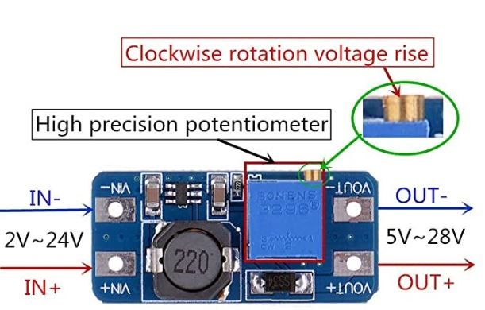  ||

# +Materiales
|   |   |   |
|---|---|---|
| mascarilla |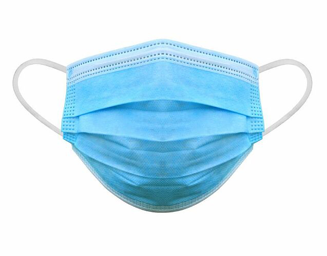  ||
| interruptor |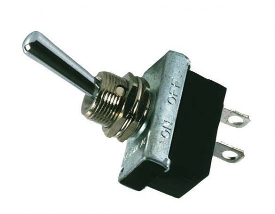  ||
| cable para soldar  |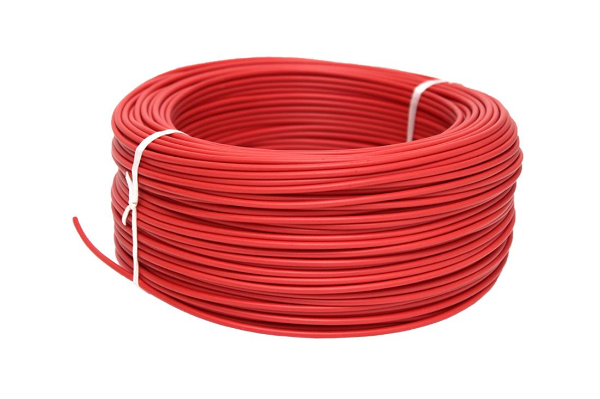||
| bateria 3.7v |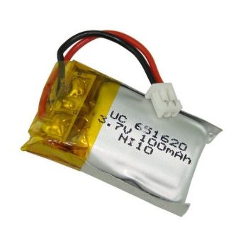  ||
| cable mini-usb  |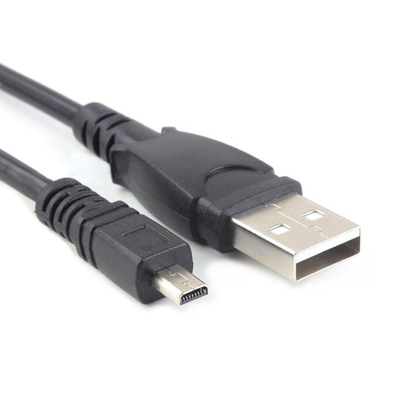||

# Herramientas
|   |   |   |
|---|---|---|
| PC + Arduino IDE  | | <a href="https://www.arduino.cc/en/main/software">descarga</a> |
| cable mini-usb a usb |  |   |
| estaño para soldar | |   |
| soldador de estaño |  |   |

# Diagrama
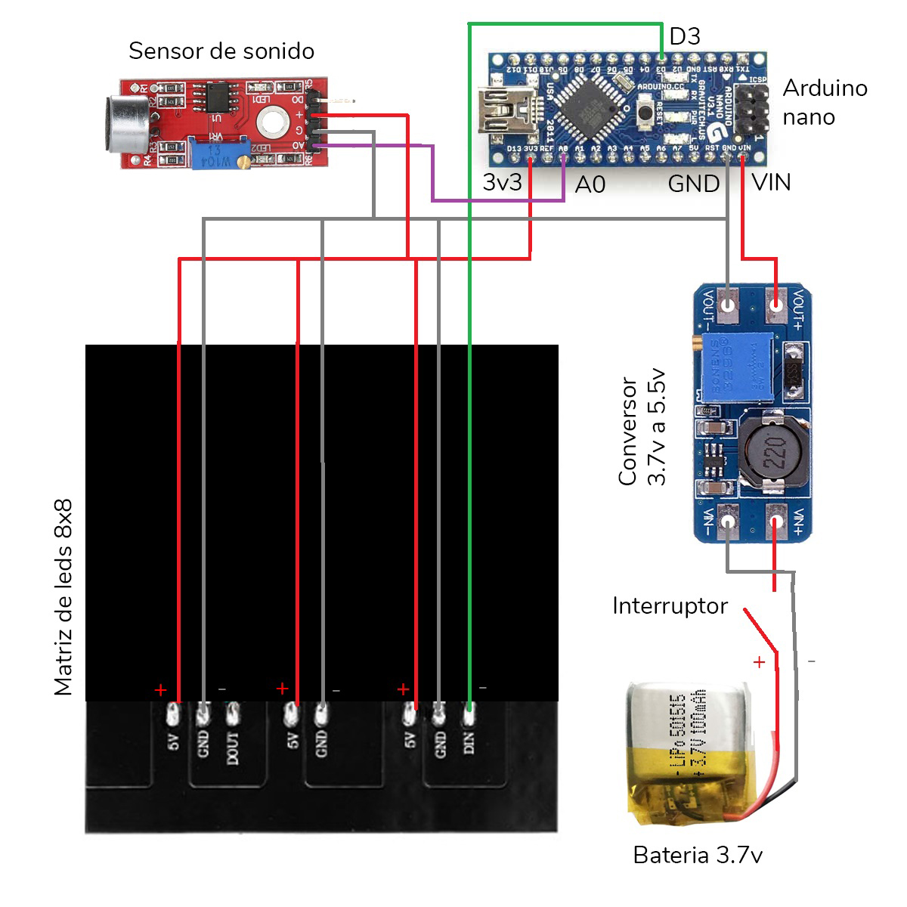

# Proceso
|   |   |
|---|---|
|  1  |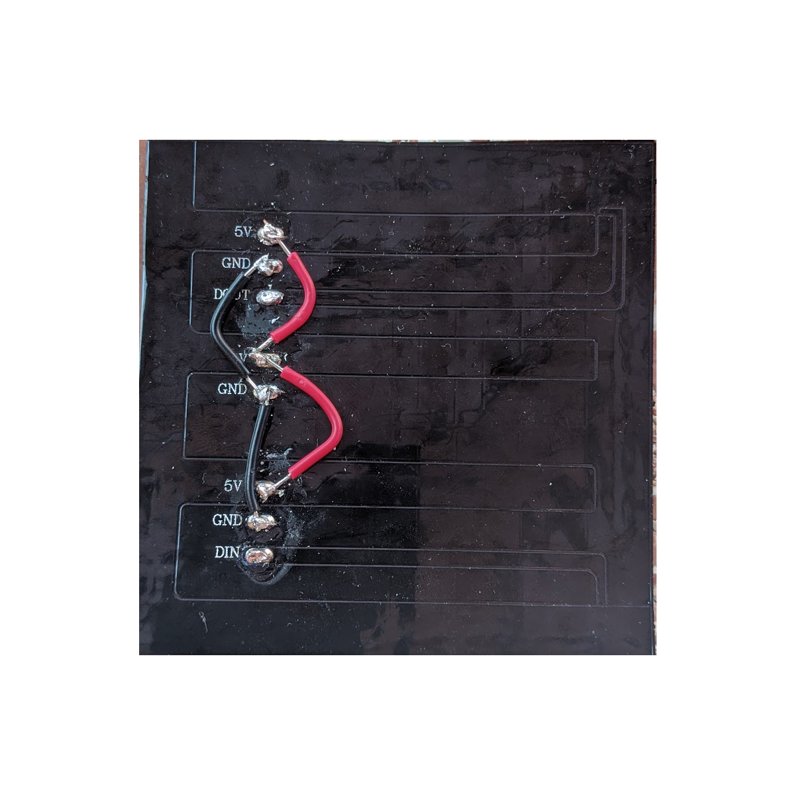 |
| 2 |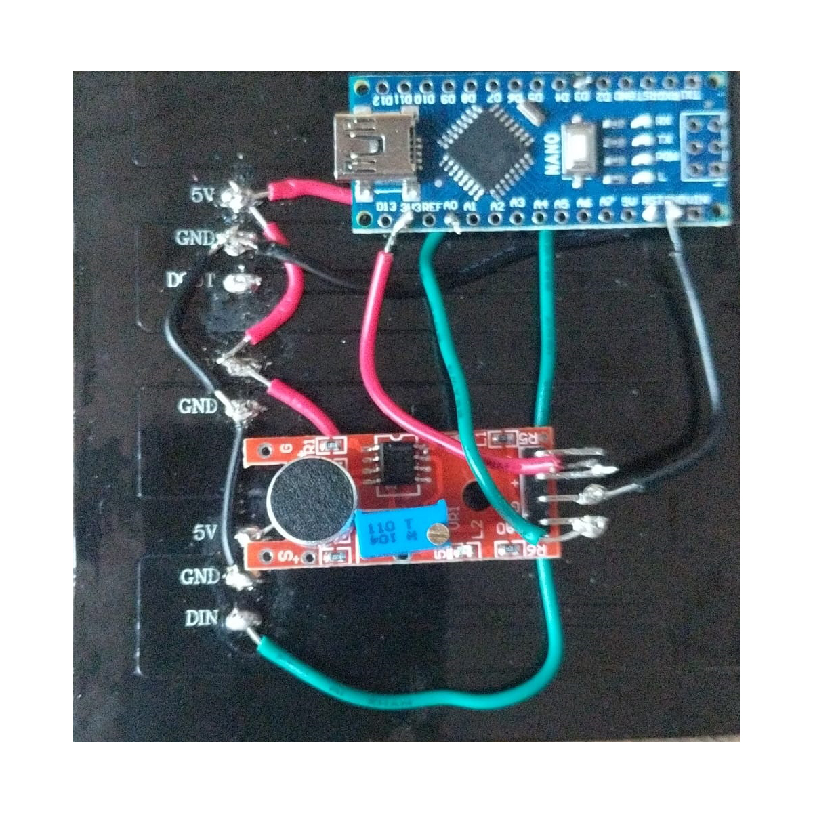 |
| 3 |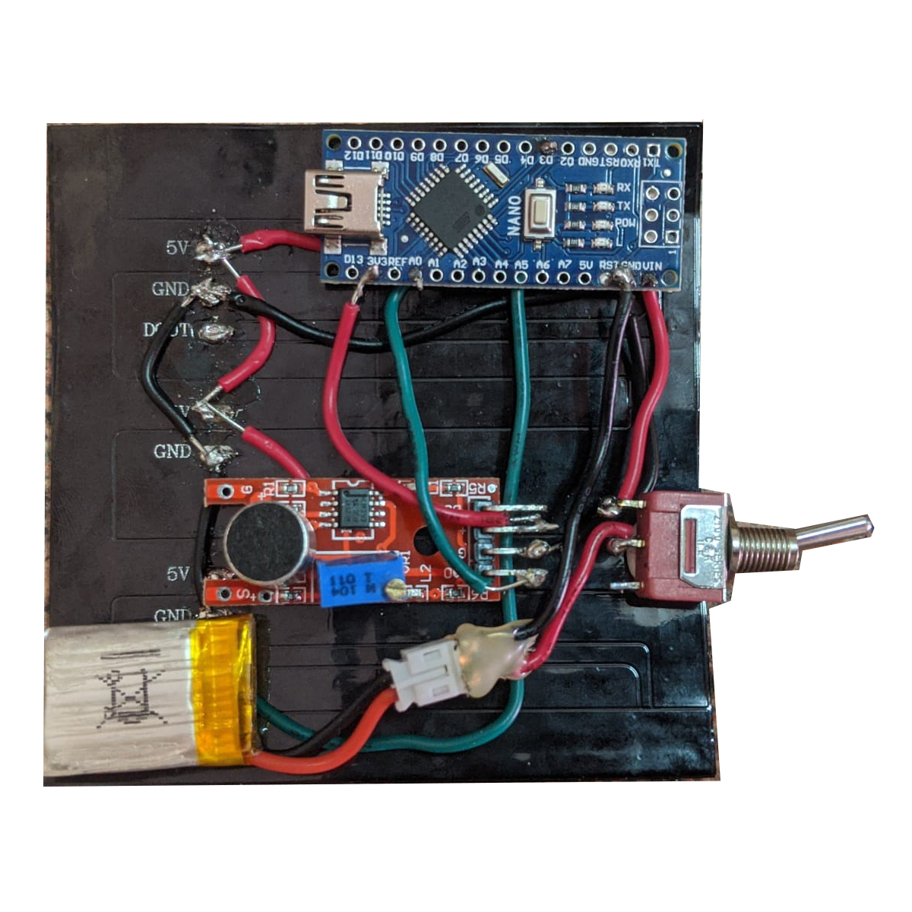 |
| 4 |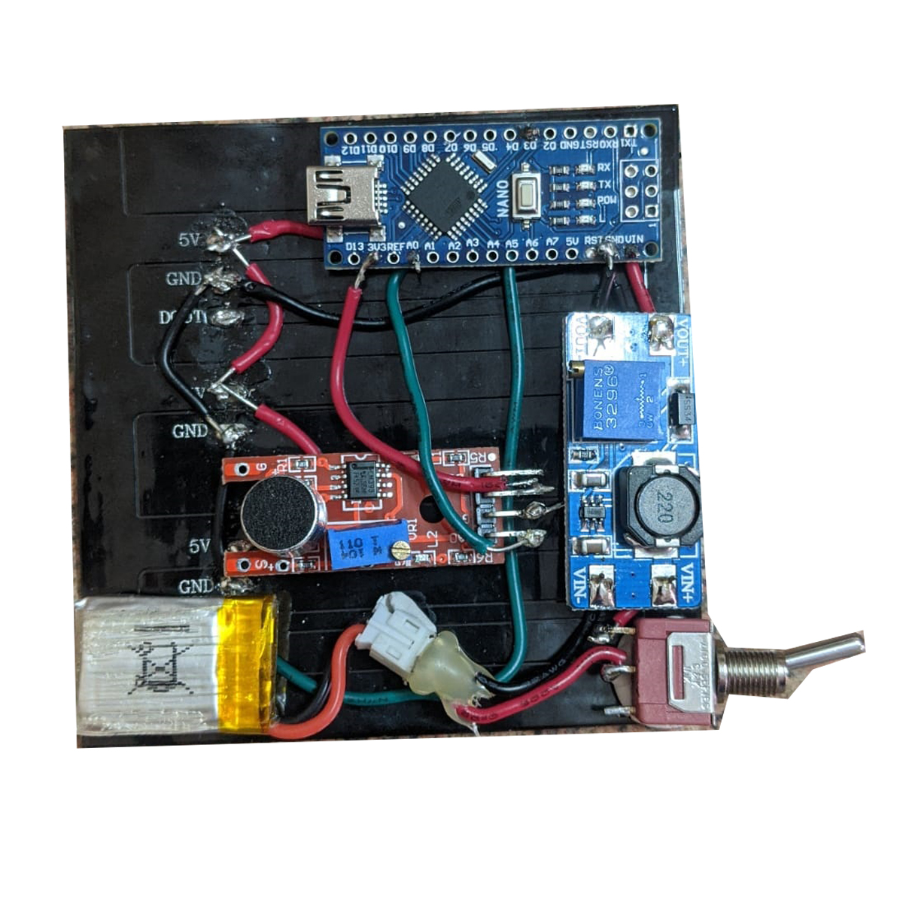 |
| Resultado final, ajustando las soldaduras |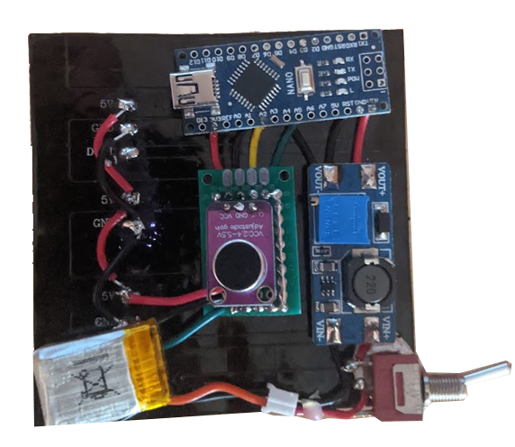 |

# Pruebas
|   |   |
|---|---|
|  1  ||
|  2  ||
|  3 ||

# Enlaces de interes
* https://www.kickstarter.com/projects/jabbermask/jabbermask
* https://www.youtube.com/watch?v=qnmPe6RFjsY

 