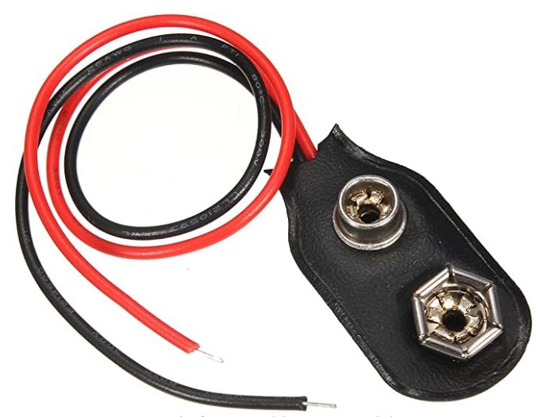
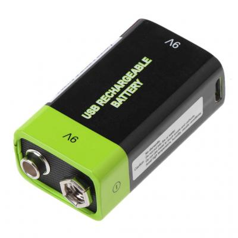

# Voicemask Arduino [EN CONSTRUCCIÓN]
Mascarilla con arduino programado que imprime en una matriz de leds la boca segun la intensidad de un sonido. Codigo basado y modificado de https://github.com/TylerGlaiel/voicemask

# Electrónica
|   |   |
|---|---|
|| Arduino nano   |
|| Matriz leds 8x8   |
|| Sensor de sonido   |

# +Materiales
|   |   |
|---|---|
|| mascarilla   |
|| conector pila 9v   |
|| cable para soldar  |
|| bateria 9v   |
|| cable mini-usb  |

# Herramientas
|   |   |
|---|---|
|| PC + Arduino IDE   |
|| cable mini-usb a usb   |
|| estaño para soldar  |
|| soldador de estaño   |

# Proceso
|   |   |
|---|---|
||  1   |
|| 2  |

 